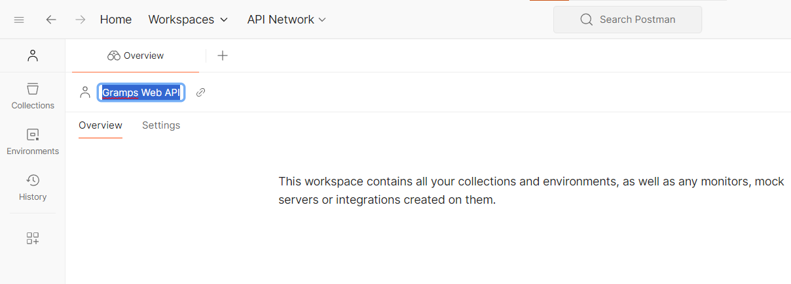
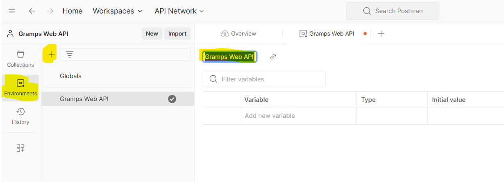
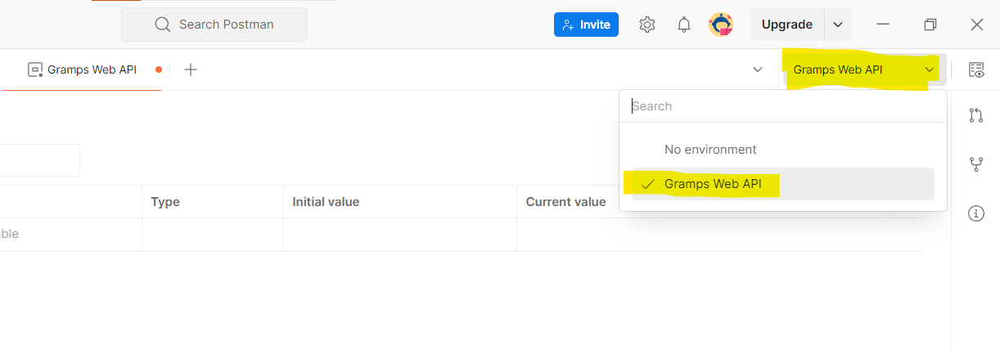
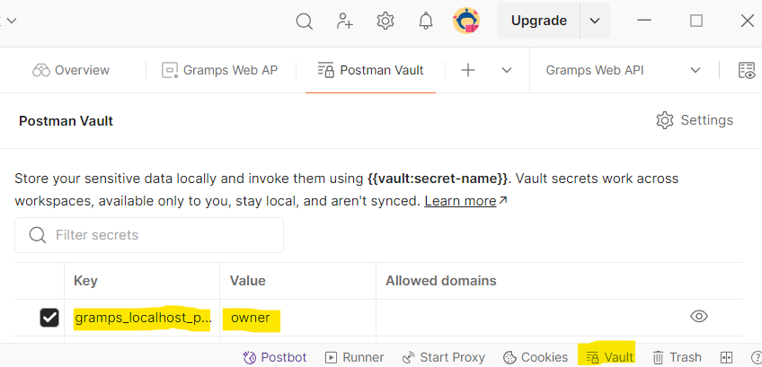
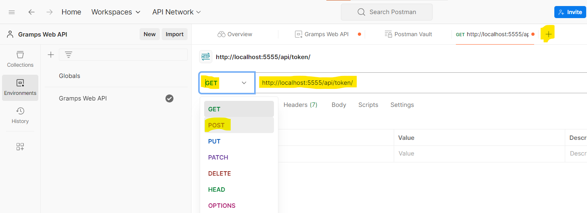
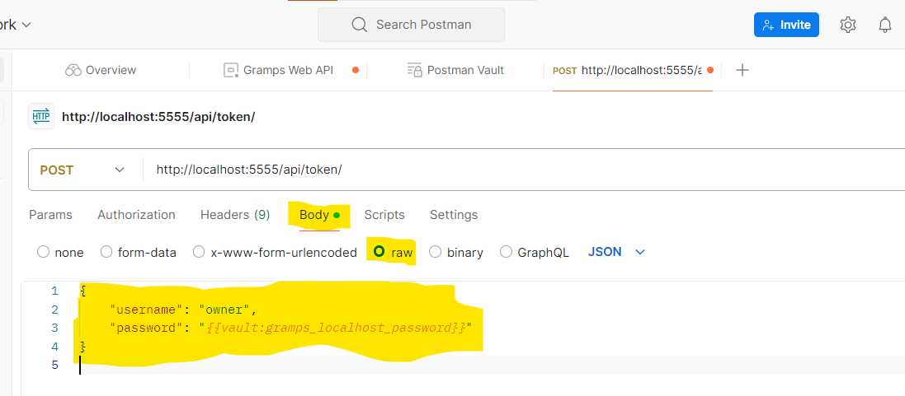
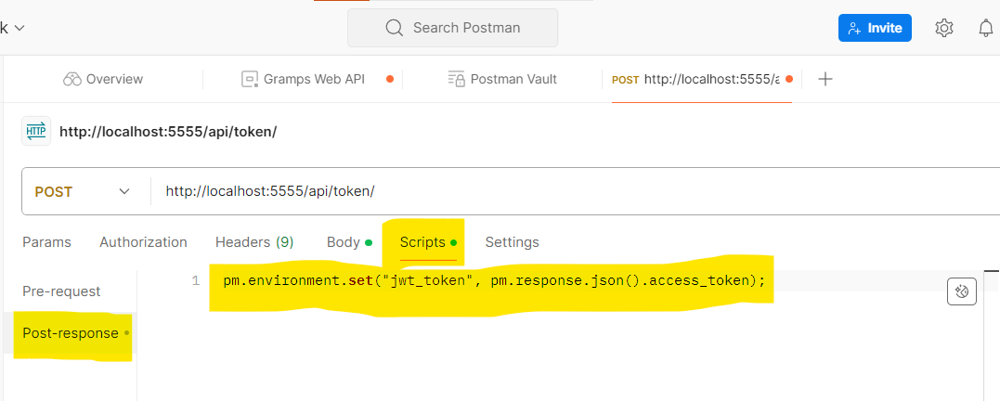
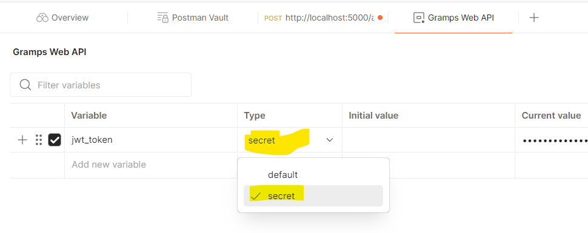
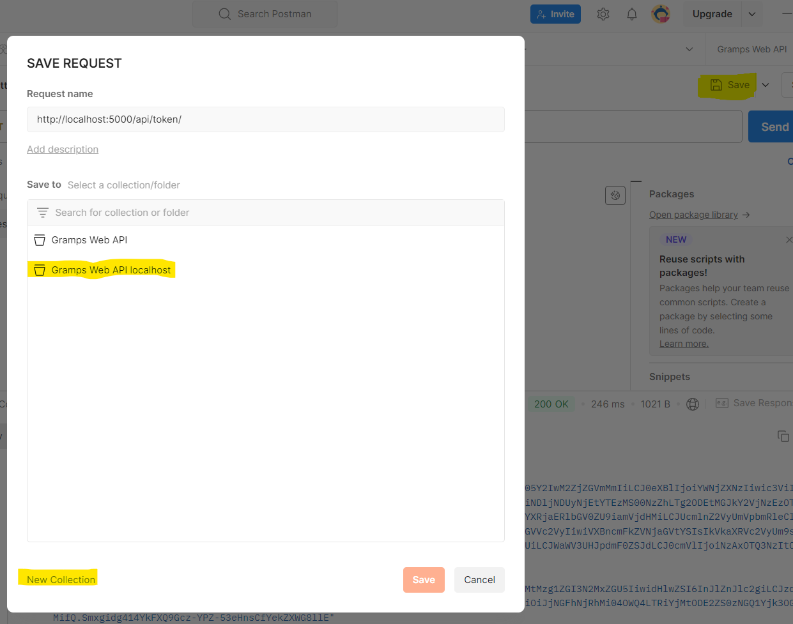
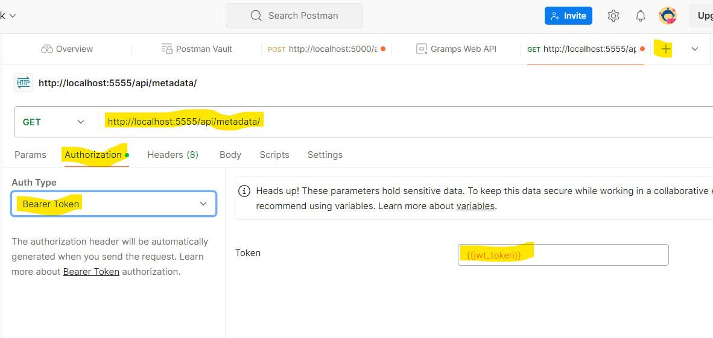

For backend and frontend development, it can be useful to send manual queries to the Gramps Web API. Using HTTPie and jq, this can be done conveniently including JWT authentication. You can also test the API queries using a tool such as [Postman](https://www.postman.com/).

## Installation

### Testing with HTTPie and jq

HTTPie is installed with `pip`:

```bash
python3 -m pip install httpie
```

You will need HTTPie version 3.0.0 or newer.

jq can be installed in Ubuntu via

```bash
sudo apt install jq
```

### Testing with Postman

Postman can be used on the web, or via the Desktop app, or as an extension for VSCode, or even via the CLI.

See the Postman [Downloads page](https://www.postman.com/downloads/) for all the options.

## Fetching an access token

To fetch an access token, query the token endpoint `/api/token/` (note: the trailing slash is required). We'll assume your development instance is running on `localhost:5555`.

### Using HTTPie and jq
You can use the command

```bash
http POST http://localhost:5555/api/token/ username=owner password=owner
```

You will see the JSON tokens as output.

Using jq, you can also store the access token in an environment variable:

```bash
export ACCESS_TOKEN=$(http POST http://localhost:5555/api/token/ \
  username=owner password=owner | jq -r '.access_token')
```

### Using Postman

First we'll name the Workspace for all of our requests to the Gramps Web API.



Next we'll create en Environment which will allow us to store our API token for usage in further requests to the API. We can also name this environment accordingly, so it will be easier to remember that it will be the environment for our Gramps Web API requests.




Set the Environment to our newly created Gramps Web API environment.



Let's store our Gramps Web API password in a secure manner to the Postman Vault. Click on **Vault** at the bottom of the window, and create a key `gramps_password` and set the value to your password. This is an extra protection that will prevent your password from being synchronized to any cloud service.



Now we'll prepare a `POST` type request to `http://localhost:5555/api/token/`.

Click on the `+` icon, enter the URL for the request, and click on the default `GET` value to change it to `POST`.




Now we'll set the **Body** to type **raw** (make sure **JSON** is set in the dropdown on the right), and the Body contents to:

```json
{
    "username": "owner",
    "password": "{{gramps_password}}"
}
```



Before clicking on **Send**, we will also create a **Post-response script** which will automatically store the token from the response to our Environment. Click on **Scripts** next to **Body**, select **Post-response**, and set the script to:

```js
pm.environment.set("jwt_token", pm.response.json().access_token);
```



Now when you click on **Send**, the access token will be retrieved from the reponse and set as an Environment variable which you can use for further requests.

If you open your **Gramps Web API** Environment again you will see that the `jwt_token` key has been set with the value of the `access_token` from the response. You can optionally further protect the value of this token by changing the **type** from **default** to **secret**.



If you go back to the POST request tab, you can also **Save** the request to a collection which you can again call **Gramps Web API**, so that you can easily send the request again in the future.



## Making further requests

You can now use this token in all API calls that require authentication.

Note that, by default, access tokens will expire after 15 minutes.

### Using HTTPie and jq

```bash
http -A bearer -a $ACCESS_TOKEN GET http://localhost:5555/api/metadata/
```

### Using Postman

Click on `+` to create a new Request, it will default to the `GET` method. Set the URL to `http://localhost:5555/api/metadata/`. Then set **Authorization** → **Auth Type** to **Bearer token** and set the **Token** value to `{{jwt_token}}`.



Now when you click on **Send** you should correctly see the Response body. You can again save this Request to your "Gramps Web API** collection for future use. Whenever your `access_token` expires, just open your `/api/token` request and click send, then go back to the initial request and click send.
