---
hide:
  - toc
  - navigation
---

# Features

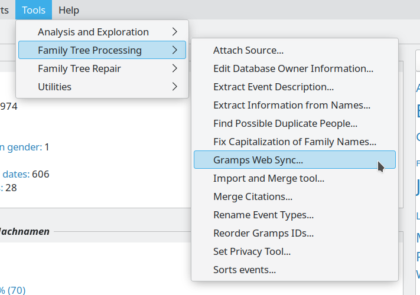{ align=left width="300"}

## Full integration with Gramps Desktop

Gramps Web uses the same **Model / Database** structure that [Gramps Desktop](https://gramps-project.org/) uses for storing genealogical data. You can browse all the same [Record Types](https://gramps-project.org/wiki/index.php/Gramps_Data_Model) you do in Gramps Desktop: ***people, families, events, places, repositories, sources, citations, media objects, and notes.***

Using the [Gramps Web Sync Add-on](../administration/sync.md) for Gramps Desktop, data can be synchronized bi-directionally between Gramps Web and Gramps Desktop! Go ahead and edit your data with Gramps Web or the Gramps Desktop App which you know and love – they work together seamlessly!

---

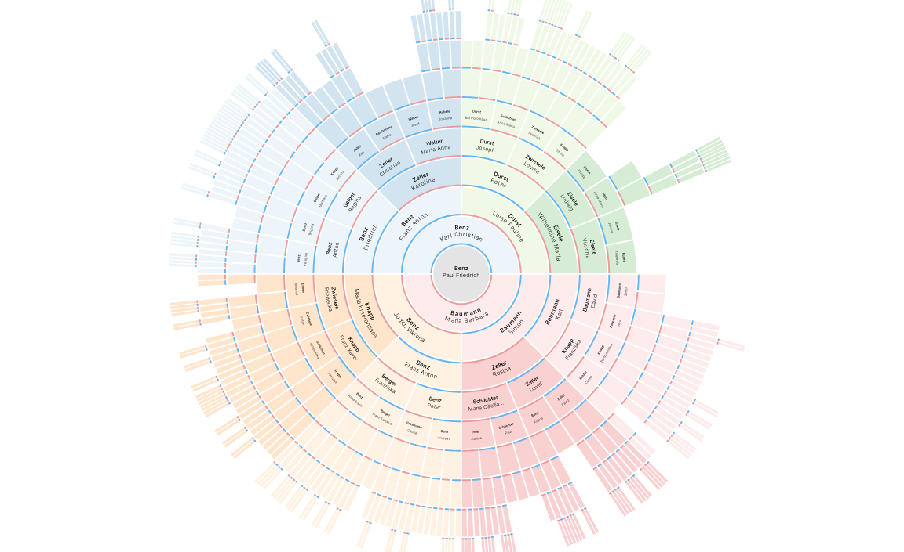{ align=right width="400"}

## Interactive family tree graphs

Navigate your family tree as an ancestor tree, descendant tree, hourglass graph, relationship graph, or fan chart, with high-quality interactive graphics and a configurable number of generations.

Hover over any person to see a preview card with their key facts, and jump straight from the chart to the full detail page.

---

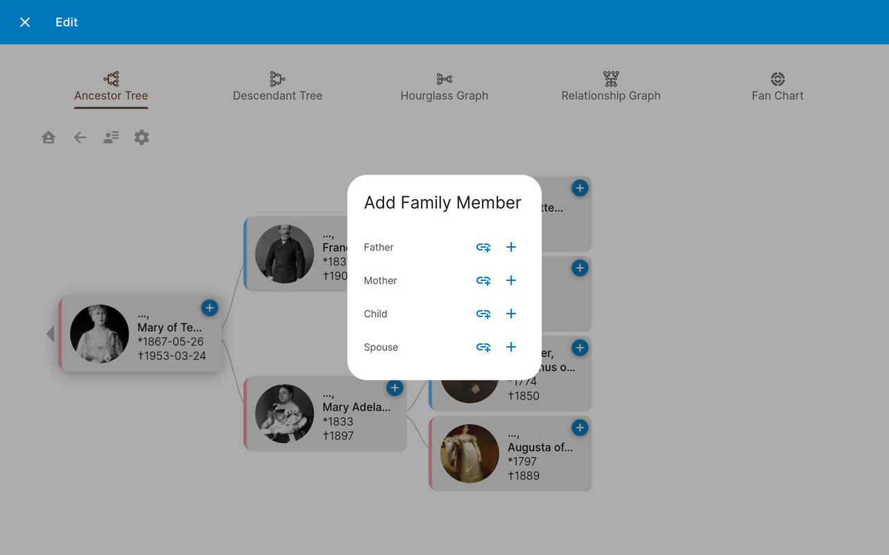{ align=left width="400"}

## Build your tree right in the chart

Switch the tree view into edit mode and grow your family tree without leaving the chart. Every person card gets a **+** button to add a father, mother, child, or spouse – either linking someone already in your database or creating a brand new person on the spot. Each change is saved immediately.

See [Editing the Family Tree](../user-guide/tree-edit.md).

---

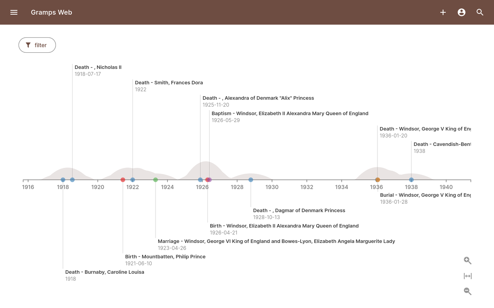{ align=right width="400"}

## Chronological timeline

See every event in your family tree laid out on a horizontal, zoomable timeline. Scroll and zoom through the centuries, then filter down to a single person – or to all of their ancestors or descendants – or to everything that happened in one place.

See [Timeline](../user-guide/timeline.md).

---

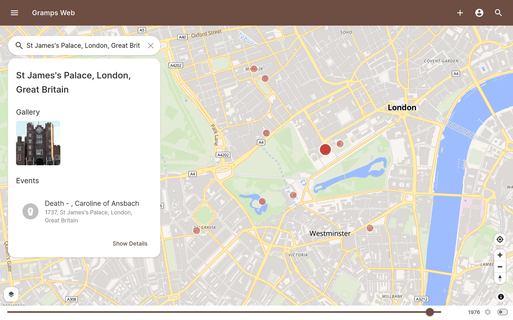{ align=left width="400"}

## Powerful map

Display all places in your tree on an interactive, searchable map. Search for new places directly on OpenStreetMap when creating a place, plot the people in your database geographically, and trace a single person's life by connecting their events with lines on the map.

---

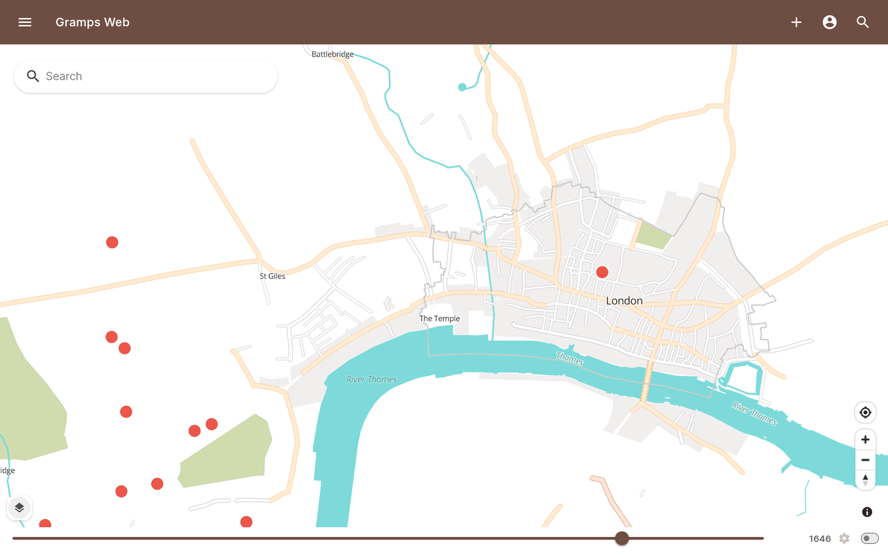{ align=right width="400"}

## Historical maps

Turn a historical map stored as a media object in Gramps into a custom map overlay.

On top of that, the historical vector maps created by the [OpenHistoricalMap](https://www.openhistoricalmap.org/) project are the perfect complement to genealogical mapping. Use the time slider to scroll through the evolution of the places in your family history and display the places where ancestors lived or events happened.

---

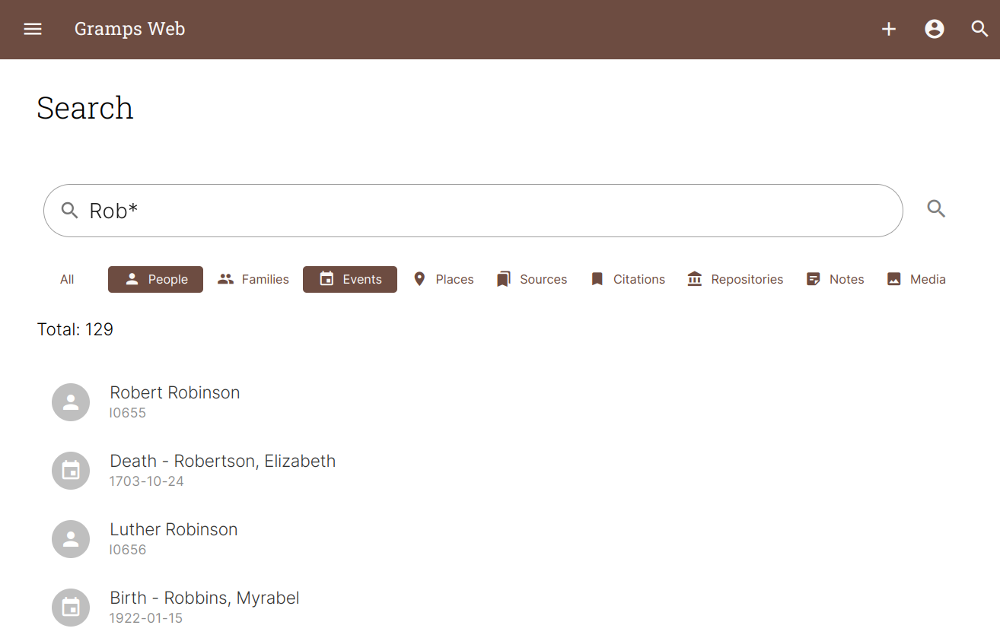{ align=left width="400"}

## Find anything

The full-text search engine covers all Gramps object types, including the content of text notes, and supports wildcards and logical operators.

If your server has it enabled, **semantic search** answers natural-language queries like "farmer in Bavaria in the 19th century" by meaning rather than by exact words. For precise queries, the object list views offer an advanced filter mode based on the [Gramps Query Language](../user-guide/gql.md), alongside quick filters by text, tag, and privacy.

From any person's page, [External Search](../user-guide/external-search.md) opens a pre-filled search on FamilySearch, Ancestry, CompGen and other sites – and you can add your own.

---

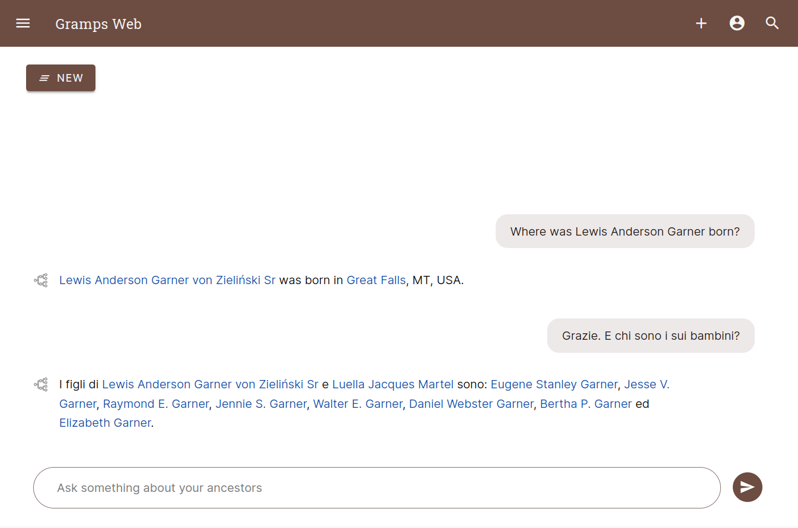{ align=right width="400"}

## Integrated AI assistant

Powered by AI, Gramps Web allows you to chat with your family tree – in your native language!

The assistant doesn't just search: it queries your database directly with a set of tools, filtering people, events, families and places, and calculating relationships between individuals. You can watch which tools it is using as it builds an answer, and longer questions run as background tasks so you can navigate away and come back.

---

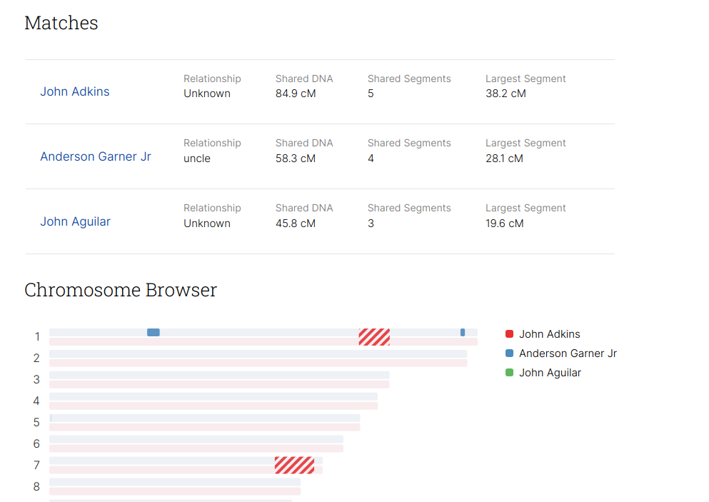{ align=left width="400"}

## DNA matches, chromosome browser & Y-DNA

If you have DNA match data from one of the DNA genealogy providers, upload it and store it in a future-proof way and view your matches in an interactive chromosome browser.

Raw Y chromosome SNP data can be used to determine a person's most likely [Y-DNA haplogroup](../user-guide/y-dna.md) and display their patrilineal ancestors in the human Y chromosome tree, with timing estimates. The analysis runs entirely on your own server – no data is sent to any third party.

---

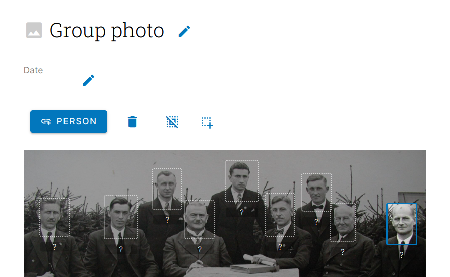{ align=right width="400"}

## Tag people in photos with automated face detection

Collaborate with your relatives to identify ancestors in old family photos. Thanks to automated face detection, tagging people is just two clicks away.

---

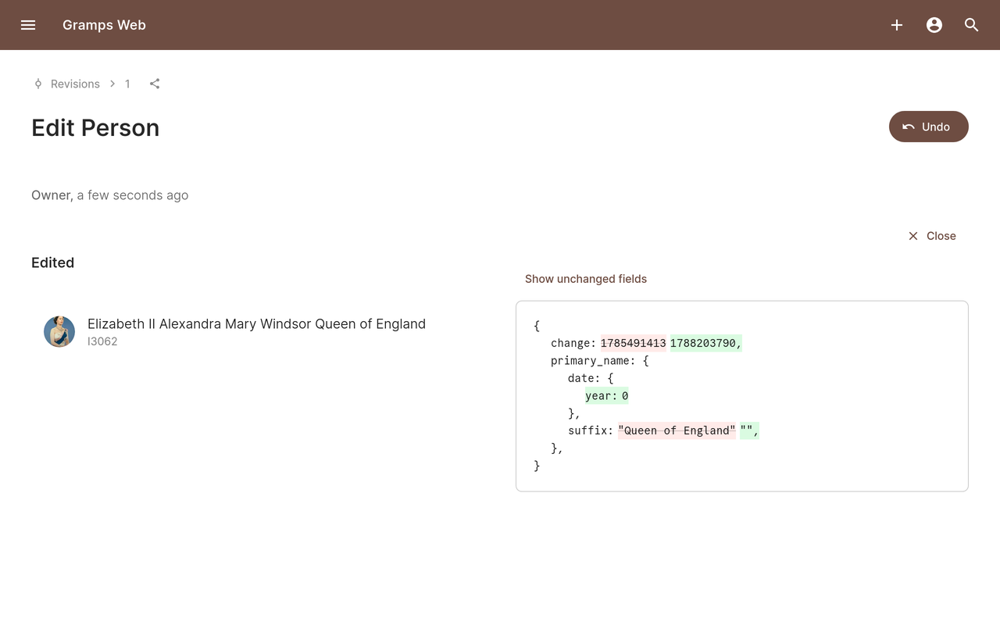{ align=left width="400"}

## Full revision history – with undo

Every edit to your family tree is recorded. Browse the complete history grouped by transaction, drill down into any individual change to see exactly which fields were added, removed or modified, and undo a transaction if it turns out to be a mistake.

See [Revision History](../user-guide/revisions.md).

---

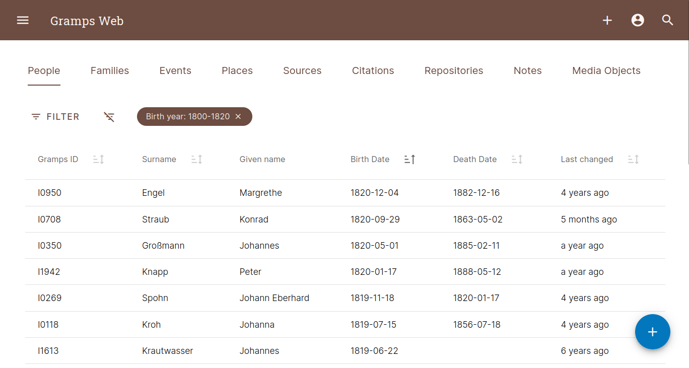{ align=right width="400"}

## Privacy levels & user access

Many folks want to keep some details private and we respect that! You can mark records as private and control which users are allowed to view private records. Private records are filtered out at the database layer for maximum security. In addition, you can control what users are able to add and edit.

Users can sign in with a password, or through an external identity provider using [OpenID Connect](../install_setup/oidc.md) – Google and Microsoft out of the box, plus custom providers such as Keycloak, Authentik and Authelia.

---

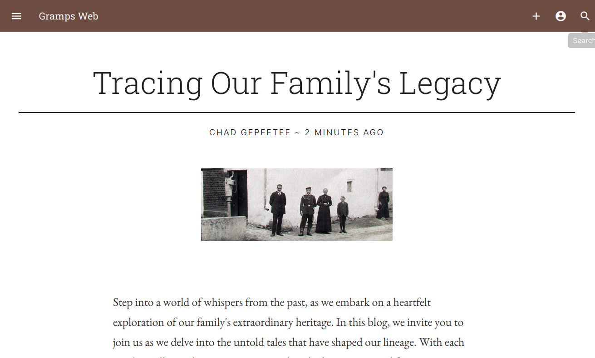{ align=left width="400"}

## Genealogy blog included

Summarize your research in the form of blog stories with pictures, and share them with your relatives. A dedicated editor makes writing a new post straightforward. All data is stored in the Gramps database.

---

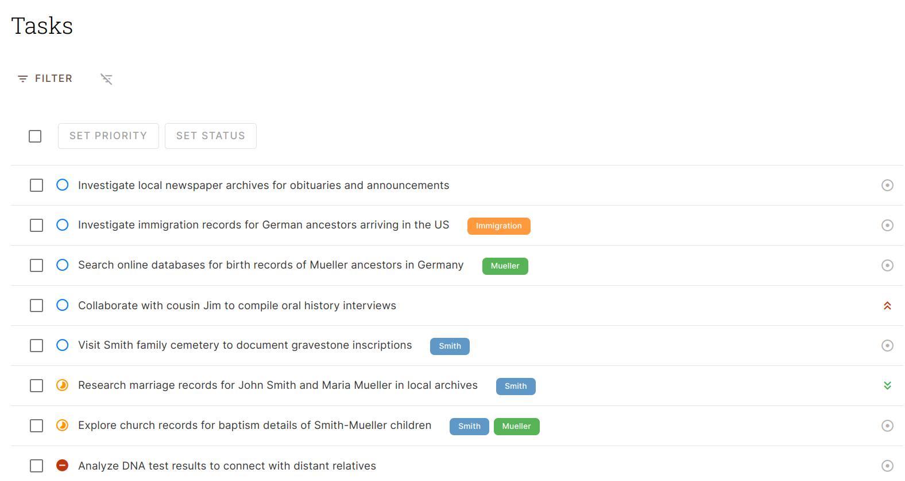{ align=right width="400"}

## Integrated task management app

Gramps Web comes with an integrated task management app to organize and plan your genealogical research. Give each task a status, a priority and tags, document your progress in a rich-text description, and attach the media you gathered along the way.

The tasks are stored as sources in the Gramps database, so they form part of your genealogical data and can be accessed and edited in Gramps Desktop as well.

---

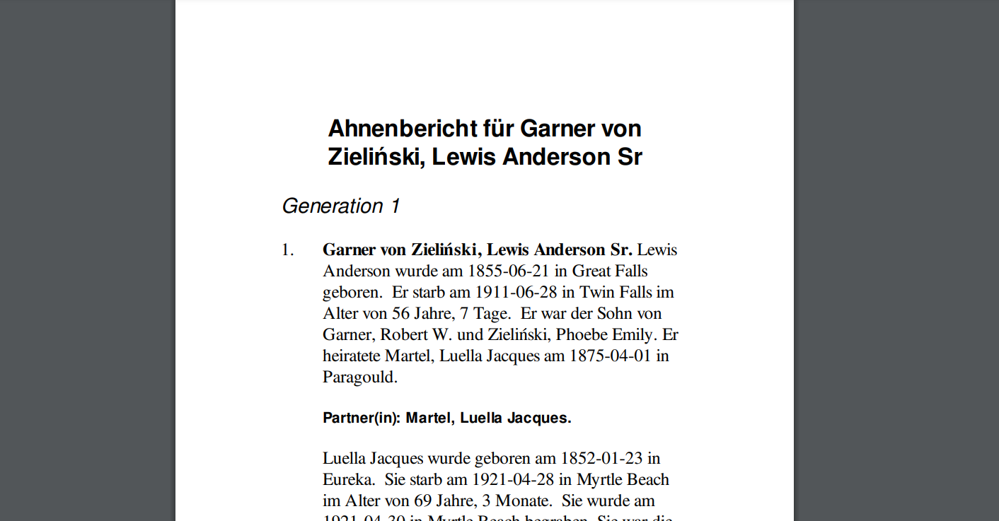{ align=left width="400"}

## Generate printable reports

Since it's built directly on the core powering Gramps Desktop, you can generate almost all of the [reports](https://gramps-project.org/wiki/index.php/Gramps_5.2_Wiki_Manual_-_Reports) the desktop app supports right from the browser, including relationship graphs or book reports as PDF.

---

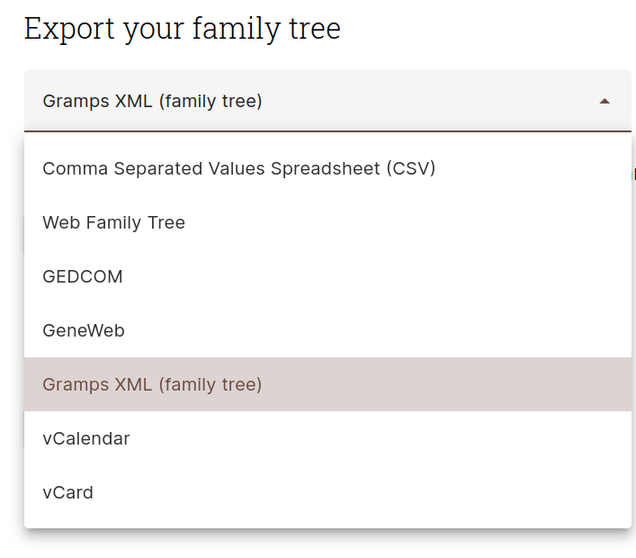{ align=right width="300"}

## No lock-in – data import and export

Apart from being able to import data in various formats including Gramps XML and GEDCOM, Gramps Web makes it easy for users to download all of their data (family tree data, media files, user accounts) anytime, for backup purposes or to move to a different server. Your data is yours alone!

Imports can be previewed as a dry run before anything is written, and a complete backup can be restored back into the tree.

---

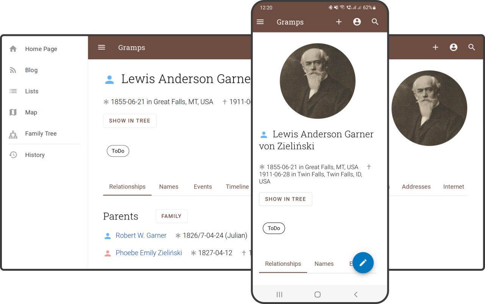{ align=left width="400"}

## Works on every device

Access Gramps Web from any web-enabled device. You can upload photos, create or edit records, show your family tree to others, or look up those family member names you can't remember at your next family reunion!

Gramps Web is a progressive web app: install it to your home screen or desktop and it behaves like a native app. On the desktop, [keyboard shortcuts](../user-guide/shortcuts.md) get you anywhere in a couple of keystrokes – press `?` to see them all.

---

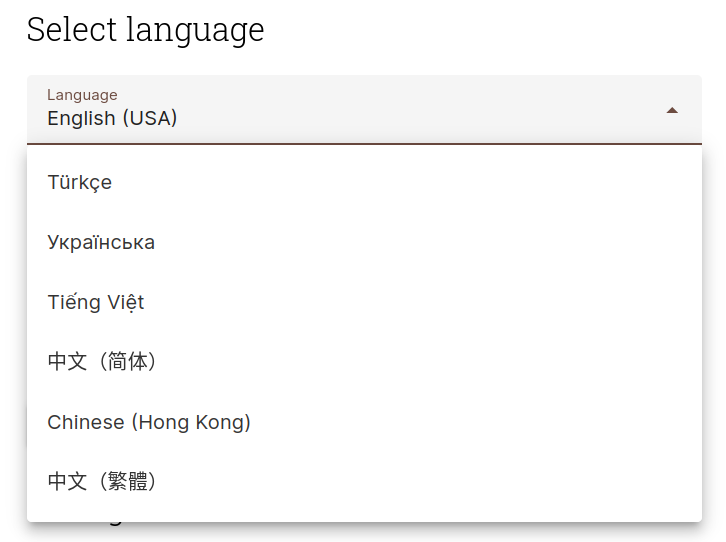{ align=right width="300"}

## Fully internationalized

Switch the language of the interface between any of over 50 languages translated by the Gramps community.

---

## And more

- **Notifications and background tasks** – imports, exports, reports and index rebuilds run in the background, with progress and errors collected in one place
- **Anniversaries in your calendar** – subscribe to your family's birthdays and anniversaries from any calendar app
- **Tags, bookmarks and history** – organize objects with colour-coded tags and get back to what you were working on
- **Bulk editing** – select multiple objects in the list views to delete them at once, or merge duplicate objects
- **Customizable list views** – choose which columns to show, and filter by text, tag, or privacy
- **Text recognition (OCR)** – extract text from scanned documents in your media gallery
- **Data verification** – check your tree for implausible dates and other data problems
- **Make it your own** – give your site its own name, theme colours, and home page text and image

&nbsp;

## Demo

To login to the Demo, use any one of the following ***USER / PASS*** login credentials.  Each represent a user type that a Gramps Web user may be assigned to.

`owner / owner`  
`editor / editor`  
`contributor / contributor`  
`member / member`

[Go to Demo Login](https://demo.grampsweb.org/){ .md-button .md-button--primary target="_blank"}

### Thanks

The demo is kindly supported by DigitalOcean.

