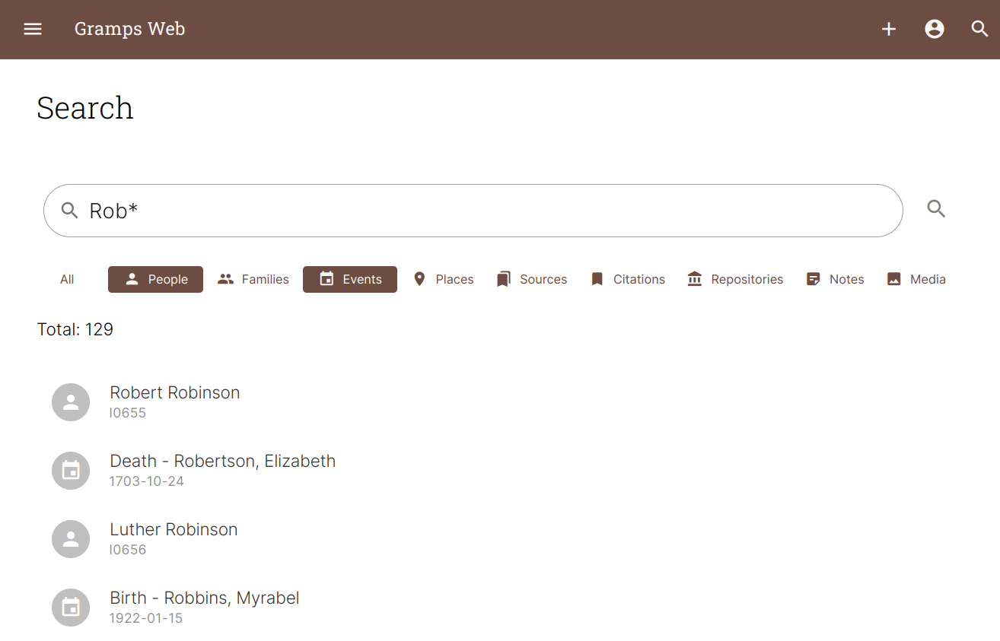

---
hide:
  - toc
  - navigation
---

#

<h1 style="font-weight:600;color:rgba(0, 0, 0, 0.7);">Research & organize your family tree together</h1>

**Gramps Web** is a web app for collaborative genealogy. It is based on and interoperable with [Gramps](https://gramps-project.org/blog/), the leading open source genealogy desktop application. Gramps Web is free & open source software and puts your privacy and your control of your research data first.

<!--  -->

&nbsp;

{ align=right width="400"}

## Access to all your data, respecting privacy

Browse all objects in your family tree: people, families, events, places, repositories, sources, citations, media objects, and notes.

Choose for each user whether they are allowed to view records marked as private. Private records are filtered out at the database layer for maximum security.

{ align=left width="400"}

## Collaborative editing & adding data on the go

Grant users the right to add new or editing existing objects.

Upload new sources, photos, or create new objects from any device.

{ align=right width="400"}

## Interactive family tree graphs

Navigate your family tree as an ancestor chart, descendant chart, hourglass chart, or as fan chart, with high-quality interactive graphics and configurable number of generations.

{ align=left width="400"}

## Powerful map

Display all places on an interactive, searchable map.

Turn a historical map stored as media object in Gramps into a custom map overlay.

{ align=right width="400"}

## Genealogy Blog included

Summarize your research in the form of blog stories with pictures. All data is stored in the Gramps database.

{ align=left width="300"}

## Fully internationalized

Switch the language of the interface between any of 40 languages translated by the Gramps community.

{ align=right width="300"}

## No lock-in &ndash; data import and export

Apart from being able to import data in various formats including Gramps XML and GEDCOM, Gramps Web makes it easy for users to download all of their data (family tree data, media files, user accounts) anytime, for backup purposes or to move to a different server. Your data is yours alone!

{ align=left width="400"}

## Generate printable reports

Since it's built directly on the core powering Gramps Desktop, you can generate almost all of the [reports](https://gramps-project.org/wiki/index.php/Gramps_5.2_Wiki_Manual_-_Reports) the desktop app supports right from the browser, including relationship graphs or book reports as PDF.

{ align=right width="300"}

## Full integration with Gramps Desktop

Gramps Web uses the core of [Gramps](https://gramps-project.org/), the most powerful and popular open-source cross-platform desktop application. It does not only use the same data model and database for storing genalogical data, but can also be synchronized both ways using a Gramps addon.

Edit your tree on the Web and in the fully-featured desktop app you've grown to love &ndash; they work together seamlessly.

{ align=left width="400"}

## Tag people in photos with automated face detection

Collaborate with your relatives to identify ancestors in old family photos. Thanks to automated face detection, tagging people is just two clicks away.

{ align=right width="400"}

## Powerful full-text search

The search engine supports searching all Gramps object types, including the content of text notes, and supports wildcard syntax and logical operators.

{ align=left width="400"}

## DNA matches & chromosome browser

If you have DNA match data from one of the DNA genealogy providers, upload it and store it in a future-proof way and view your matches in an interactive chromosome browser.

{ align=right width="400"}

## Integrated task management app

Gramps Web comes with an integrated task management app to organize and plan your genealogical research. The tasks are stored as sources in the Gramps database, so they form part of your genealogical data an can be accessed and edited in Gramps Desktop as well.

{ align=left width="400"}

## Integration of OpenHistoricalMap

The historical vector maps created by the [OpenHistoricalMap](https://www.openhistoricalmap.org/) project are the perfect complement to genealogical mapping. Use the time slider to scroll through the evolution of the places in your family history and display the places where ancestors lived or events happened.

&nbsp;

## Demo
[Open Demo](https://demo.grampsweb.org/){ .md-button .md-button--primary target="_blank"}

Use `owner`, `editor`, `contributor`, or `member` as username and the same as password.