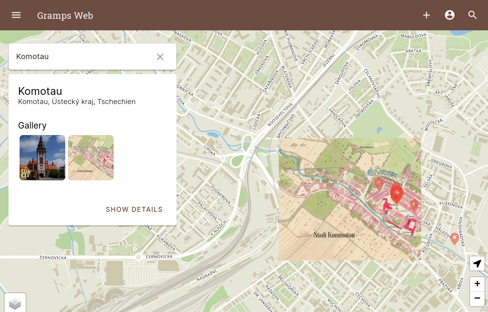
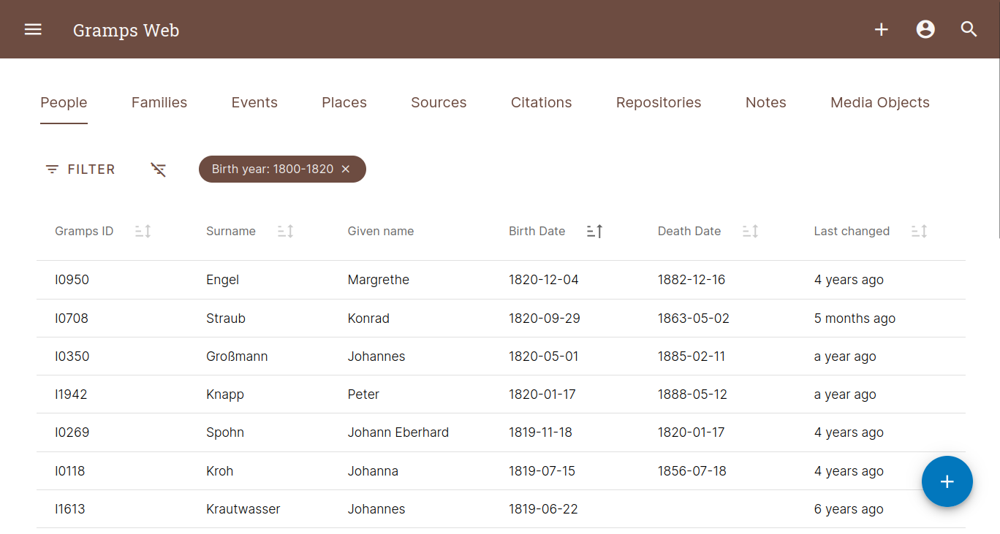

---
hide:
  - toc
  - navigation
---

<!-- 
Default Material Margins are poor and not per good layout guidelines. We tweak them slightly on this page only.  Its
the landing page, so we want it to look nice
-->

 
 
 
#	Welcome to Gramps Web!

  
   <i>Click image to see more Screenshots!</i>

 
 
 <!-- 
by using HTML below, we can set these image display to 'none' so the image do not show; however, they will show if 
the user clicks the first image above and goes into 'glightbox' mode.  Users can then 'scroll' through the various
GrampsWeb UI images.  Those who don't notice the 'next' arrow in glightbox and only view the one image displayed, 
then no harm, no foul, behavior is as expected; however, for others who do notice the 'right arrow' button in 
glightbox, then they can view additional images if they like.  win-win
 -->
 

  
  
  
  
  
  
  
  
    
    

**Gramps Web** is a Web Browser based application, ideally suited for collaborating with others to build your family tree together. It can be accessed from any mobile or portable web-enabled device. Gramps Web is free & open source software, with the privacy and control of your data a top priority!

Gramps Web is designed to be a companion to [***Gramps Desktop***](https://gramps-project.org/blog/), the leading open source genealogy desktop application.  <u>Gramps <b><i>Desktop</i></b></u> is the primary tool for building and managing your genealogy database and <u>Gramps <b><i>Web</i></b></u> is a portal, through which others can contribute to the database from afar without having to learn or install Gramps Desktop.

*	[Gramps Web Features Overview](features/features.md) 
*	[Install and Setup Information](install_setup/setup.md)
*	[Web Administrator's Guide](administration/admin.md)
*	[User Guide](user-guide/index.md)

***Want to try a Demo?***  Click the button below and login using any one of the following four usernames below. Use the same name for the password also.

`owner / editor / contributor / member ` 

[Go to Demo Login](https://demo.grampsweb.org/){ .md-button .md-button--primary target="_blank"}

